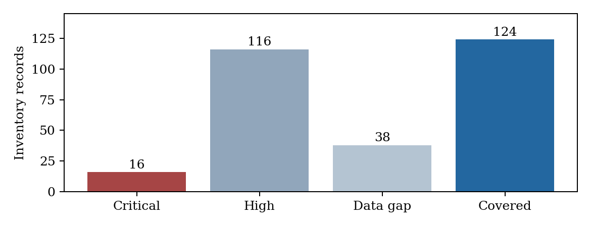
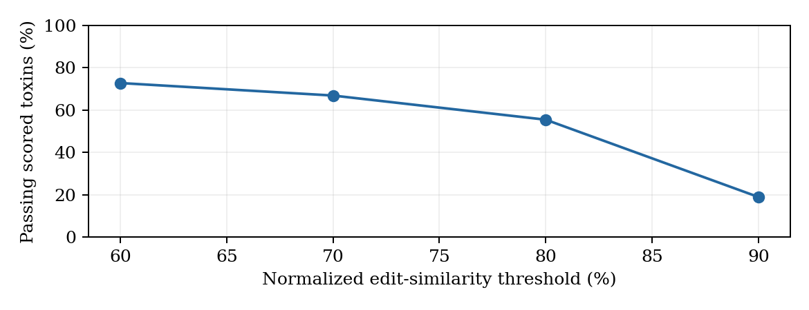

# Snakebite antivenom coverage atlas: an evidence audit

B09 data-audit slice. Research paper and review kit. 8 October 2026. Status: documented unsealed closeout, not a clinical treatment guide.

Abstract. We joined a historical antivenom indication matrix with WHO species-list extraction, UniProt toxin records and structure cross-references. The baseline contains 294 inventory records but 252 distinct canonical labels, not 294 independent species. Its gap classes are 16 CRITICAL, 116 HIGH, 38 DATA GAP and 124 covered. Of 5,131 toxin accessions, 3,644 join to the audit scope. A family-restricted sequence screen scores 290 toxins across 38 uncovered labels, with 161 passing an 80% normalized edit-similarity threshold. Independent review reproduced the substantive numerical outputs and verified all baseline accessions in a current UniProt query. A second, dated WHO catalogue contributes 30 assessment-list rows without guessed product merges. Identity collisions, incomplete live product/object validation and provenance/reproduction gaps prevent a COMPLETE seal.

The usable contribution is an offline query tool and an inspectable joined inventory. Similarity is a candidate screen, not measured antibody binding or clinical neutralization.

Figure. Historical inventory gap classes; counts are records, not independent species.

# 1. Problem and hypothesis

A historical antivenom indication matrix does not express whether a snake label has molecular records, whether those records have structure links, or whether uncovered-label toxins resemble toxins of listed-covered labels. The audit joins these evidence layers while retaining missing data.

Hypothesis: listed product coverage and toxin-record richness are associated in the historical inventory. An exploratory hypothesis asks whether gap classes differ across WHO regions. A sequence-screening hypothesis asks whether uncovered-label toxins have high normalized edit similarity to toxins from covered labels within a rule-assigned family.

The unit matters. An accession is not a species, an inventory row is not necessarily an independent species, and a product label is not a stable manufacturer/formulation ID. Research attention can influence both molecular annotation and the development or recording of antivenoms. No causal or clinical claim follows from these associations.

Baseline: main commit 6b94d537687eaf403b493934b90523bb332172e9. Independent closure preserves its bytes and places all new checks in separate closure directories.

# 2. Background and named prior art

Longbottom et al., Vulnerability to snakebite envenoming: a global mapping of hotspots, The Lancet 2018;392:673-684, DOI 10.1016/S0140-6736(18)31224-8, is the verified prior study associated with the source repository. The archived sources.md incorrectly cites Nature Communications 9:2178. That history is preserved; this paper corrects the citation.

WHO TRS 1004 Annex 5 provides a species-list cross-check. Longbottom's repository itself describes WHO database inputs, so these are separate publications but not wholly independent original observations. October closure adds an independent WHO assessment-product list as a dated catalogue extension.

Compared with the historical indication matrix, B09 adds 5,131 accession inventory rows, 3,644 scope joins, molecular family context, structural xrefs, four sequence thresholds and six query modes. This quantifies added data layers, not an accuracy or clinical-performance improvement. No speedup, predictive benchmark, binding-energy score or efficacy comparison was measured.

| Source | Role | Limit |
| Longbottom | Historical labels/indications | Not a current register |
| WHO Annex 5 | Species-list cross-check | PDF artifacts |
| UniProt | Toxin records/xrefs | Not efficacy |
| WHO assessment list | Dated catalogue extension | Non-exhaustive |

# 3. Dataset research and provenance

The baseline record gives retrieval date 23 September 2026 UTC for WHO, Longbottom and UniProt. Day precision is retained rather than inventing exact times. The structure summary separately records an AlphaFold xref pull at 18:05 UTC that day.

Stored evidence includes the official WHO PDF and layout-preserving text, archived Longbottom code/data, UniProt TSV/FASTA, an AlphaFold xref accession list and per-organism NCBI JSON responses. The closure preserves those files and adds current UniProt and WHO response captures.

The complete slice manifest SHA-256-locks data, results, code and paper. Checksums prove byte identity, not scientific correctness or complete retrieval provenance. Some baseline artifacts lack exact per-file URLs and timestamps; G1 remains partial. Current checks are dated separately and do not rewrite the original snapshot.

| Evidence | Amount | Meaning |
| Inventory | 294 rows | 252 distinct labels |
| Toxin accessions | 5,131 | All in current query |
| PDB IDs | 553 unique | Live UniProt xrefs only |
| AlphaFold links | 4,644 | Models not inspected |

# 4. Taxonomy reconciliation

The baseline extracts species-like WHO text and bridges selected spellings and genus transfers to Longbottom. Thirty initial unmatched entries are documented as 25 extraction artifacts and five resolved variants/transfers. The 25 are not additional WHO-only species.

Independent review found 294 rows but 252 distinct species-column values. Thirteen group labels recur across 55 rows, leaving 42 excess occurrences. The split_spp column distinguishes constituents, but the audit joins under the shared species label. There are 292 distinct split_spp strings, including group/blank values, not a validated biological-species count.

These collisions affect interpretation: species-card dictionaries collapse repeated labels while row-level tests retain them. Toxin records mapped to a group do not prove a constituent-species assignment. The closure records all affected rows in identity_collisions.csv. A future stable-ID re-analysis is needed; no silent correction changes baseline counts.

| Measure | Value |
| Rows | 294 |
| Distinct canonical labels | 252 |
| Distinct split strings | 292 |
| Repeated group labels | 13 |
| Affected rows | 55 |
| Excess occurrences | 42 |

# 5. Methods: joins and gap classes

Organism names are reduced to binomial-like keys and joined using source species/split labels, selected NCBI outcomes and curated synonym evidence. Protein names and keywords assign families using ordered rules. OTHER is a residual annotation class, not an externally validated biological family.

The product matrix becomes a long table. No_specific_antivenom is a sentinel, not a product. There are 451 long rows: 352 actual indication rows and 99 sentinel rows. Ninety-four distinct product labels remain.

CRITICAL means category 1 without listed products; HIGH means another row without products; DATA GAP means listed products but no joined toxins; covered means products and toxins. These are inventory conditions, not current supply or neutralization claims. Region assignment is checked against WHO text sections; 25 validation flags remain.

| Class | Rule | Rows |
| CRITICAL | Cat1, zero products | 16 |
| HIGH | Other, zero products | 116 |
| DATA GAP | Products, zero toxins | 38 |
| covered | Products and toxins | 124 |

# 6. Methods: sequence screening

Uncovered-label toxins are compared with covered-label toxins within each rule-assigned family. A prefilter requires shared distinct 8-mers at a fraction of 0.15 of the smaller set. Passing pairs use edlib global Needleman-Wunsch edit distance.

The score is 100 times (1 minus edit distance divided by the longer sequence length). It is normalized edit similarity, not conventional alignment percent identity, despite the baseline best_identity column name. The prefilter has no measured recall against exhaustive comparisons.

Thresholds 60, 70, 80 and 90 produce a sensitivity display. A label meets the inventory rule if at least half its scored toxins pass. Neither thresholds nor homolog transfer are calibrated against antivenom neutralization. The baseline's upper-bound language is not a formal clinical efficacy bound; this is candidate-generating similarity.

Figure. Similarity threshold sensitivity; sequence scores are not efficacy.

# 7. Statistical analysis

The baseline uses a region-by-gap chi-square test, Spearman correlation of toxins versus products, Mann-Whitney comparison of covered/uncovered rows, and Fisher exact test of category versus zero toxin records. Outputs are retained as historical row-level results.

Region counts may repeat records across regions. Seven of sixteen expected chi-square cells are below five, with minimum approximately 0.472. Repeated units and sparse cells weaken the usual asymptotic interpretation. The non-significant p=0.0852 neither proves equality nor supports a new region effect.

Repeated group labels and research-attention bias also limit the strong richness/product association. The category test includes 80 category-1 and 211 category-2 rows, excluding three WHO2017 rows. No held-out validation or multiple-testing adjustment is reported. These outputs motivate better evidence, not causal species-level conclusions.

| Test | Baseline output |
| Region x class | chi2 15.2; df 9; p 0.0852 |
| Richness/products | rho 0.560; p 1.25e-25 |
| Covered/uncovered | MW p 1.72e-18; medians 10/0 |
| Category/zero toxins | OR 0.44; p 0.00348 |

# 8. Results: coverage and toxin records

The gap counts partition 294 inventory records. There are 132 rows with no listed product and 162 with at least one listed product. Missing from the historical matrix does not mean no antivenom exists worldwide.

The toxin table contains 5,131 accession rows; 3,644 join to the audit scope and 1,487 remain outside it. One hundred seventy inventory rows have toxin records and 124 have none. Group assignments mean summing per-row toxin richness is not necessarily the unique accession count.

The current UniProt query contains all 5,131 baseline accessions. This establishes current query membership, not complete field immutability or clinical relevance. All archived data remain unchanged.

Figure. Historical inventory gap classes; counts are records, not independent species.

| Measure | Count |
| No listed product rows | 132 |
| At least one product rows | 162 |
| In-scope toxins | 3,644 |
| Out-of-scope/unjoined toxins | 1,487 |
| Rows with toxins | 170 |
| Rows with zero toxins | 124 |

# 9. Results: structure context

Among 3,644 matched toxins, 3,331 have AlphaFoldDB xrefs, 222 have PDB xrefs and 3,332 have either. Derived intersections give 221 with both and 312 with neither. These are annotation availability counts, not downloaded-structure accuracy or assay validation.

Direct division gives 91.4% AlphaFold coverage to one decimal; the baseline progress note says 91.5%. Counts are preserved and the rounding discrepancy is recorded. A predicted link is not evidence of a confident relevant epitope model.

The closure ledger checks 553 unique baseline PDB IDs and 4,644 AlphaFold-linked accessions against current UniProt xrefs. All remain referenced. Direct provider-object resolution and quality inspection were not done, so G2 does not pass on this evidence.

| Matched toxin xrefs | Count | Share |
| AlphaFoldDB | 3,331 | 91.4% |
| PDB | 222 | 6.1% |
| Either | 3,332 | 91.4% |
| Both, derived | 221 | 6.1% |
| Neither, derived | 312 | 8.6% |

# 10. Results: sequence candidates

All 290 uncovered-label toxins in the joined inventory appear in the screen, across 38 labels. At threshold 80, 161 pass and 24 labels have at least half their available scored toxins passing. This does not mean an antivenom rescued 24 uncovered species.

Threshold sensitivity is large: passing counts fall from 211 at 60 to 55 at 90. At 90, eight labels meet the half-inventory rule and 30 do not. PROGRESS incorrectly reverses that direction. The closure corrects the interpretation without rewriting baseline data.

No binding energies, measured antibody affinities, docking-performance benchmark or clinical potency estimates exist in B09. The denominator is the available accession inventory, not venom abundance or a complete proteome.

| Threshold | Passing toxins /290 | Half inventory /38 | Fails rule /38 |
| 60 | 211 (72.8%) | 29 | 9 |
| 70 | 194 (66.9%) | 27 | 11 |
| 80 | 161 (55.5%) | 24 | 14 |
| 90 | 55 (19.0%) | 8 | 30 |

# 11. Tool built from the audit

coverage_atlas.py provides six offline views: species cards, region summaries, family inventories, product lookups, the CRITICAL list and sequence cross-reference views. It reads committed tables without network access. This makes the joined research inventory usable.

The Naja naja card reports 233 toxin records and five product labels, while inheriting broad country fields from the historical source. It is not a current distribution map or prescribing guide. Species dictionaries keyed by shared labels collapse 42 excess repeated-label occurrences.

The quantified advance over Longbottom is added audit resolution: 5,131 accession records, 3,644 scope joins, molecular-family and structural context, four similarity thresholds, negatives and query access. No measured predictive improvement or runtime speedup was established. Stable IDs and split-species policies are future work.

| Mode | Example argument |
| species | Naja naja |
| region | The Americas |
| family | PLA2 |
| product | SAIMR |
| critical | No argument |
| xref | Echis ocellatus |

# 12. Independent closure and reproduction

A fresh clone and anonymous remote readback verified baseline main SHA 6b94d537687eaf403b493934b90523bb332172e9. Existing partial checksums passed. In a separate copy, synonym mapping, audit tables, gap table, statistics and sequence screening regenerated substantive baseline outputs byte-identically.

One exception is the disagreement table. Its synonym builder reads an unmatched-name negative file that the audit later narrows to 25 artifacts. A later rerun drops five previously resolved variants from the 30-row table. That state-dependent delta is documented, and the original is preserved.

No committed structure-summary generator exists, and several historical intermediate negatives lack a complete documented rebuild. Core reproduction is evidence of reproducibility for those outputs, not a full G5 pass. Baseline had nine Python scripts, not the ten claimed in the dispatch context.

| Unit | Review result |
| Core counts/scores/stats | Reproduced |
| Disagreement table | Five rows lost on state-dependent rerun |
| Structure summary generator | Absent in baseline |
| Original scientific files | Unchanged |

# 13. Honest negatives and limits

Seven baseline negative files preserve WHO extraction rejects, parsing leftovers, unmatched names, orphan toxin organisms, overlap checks and region validation. No re-fishing replaces an unfavorable outcome. Missing annotations are not proof that a species lacks venom toxins.

The audit reports p=0.0852 for the regional test, 25 region flags, 1,487 unjoined toxin accessions, 312 matched toxins without either structure xref, 124 zero-toxin rows and 30 labels failing the strict half-inventory rule. Product identities remain unresolved rather than guessed.

Not every gate-required negative class has a separate complete ledger. Failed/expired lookup coverage and all products without indications are incompletely documented. A useful audit exposes this missing evidence; it does not turn retention of seven files into proof that G4 is complete.

Next steps are stable taxonomy/product identities, direct object resolution, provenance reconstruction from genuine records and a revised independent-species analysis. Clinical performance requires appropriately authorized experimental evidence.

# 14. Gate status and unsealed landing

Closure delivers the paper, complete checksum inventory, dated WHO extension, identifier status ledger and independent baseline review. It deliberately does not label B09 COMPLETE. Generic product labels and unresolved direct structure/taxonomy checks block G2.

The paper follows problem, background, methods, statistical analysis, results, negatives and usable tool. Added data layers are quantified; clinical or predictive-performance improvement is not claimed. G7 is delivered as an honest arc, not a claim that every research ambition was met.

No money was spent and no external communication was sent as the user. Locked gates remain unchanged. Future remediation must preserve these distinctions instead of moving gate definitions to fit a favorable conclusion.

| Gate | Status |
| G1 | PARTIAL: per-file provenance gaps |
| G2 | BLOCKED: live identity/object gaps |
| G3 | PARTIAL: WHO extension, unresolved reconciliation |
| G4 | PARTIAL: missing full negative ledgers |
| G5 | PARTIAL: core reproduced, history/order gaps |
| G6 | PASS: full closure checksum inventory |
| G7 | Paper delivered; benchmark limit explicit |
| G8 | PASS: access only, no spend |

# Appendix A. CRITICAL inventory records

The following 16 historical category-1 labels have no product listed in the matrix. CRITICAL is a rule-defined inventory class, not a clinical urgency score. No current antivenom recommendation follows from this table.

Toxin counts and WHO regions are preserved from the committed gap table. Unmapped region assignments remain explicit. Current taxonomic identity, distribution and product availability require separate evidence.

| Baseline label | Toxins | Region |
| Agkistrodon taylori | 0 | The Americas |
| Atractaspis andersonii | 2 | unmapped |
| Bothrops bilineatus | 1 | The Americas |
| Bothrops leucurus | 10 | The Americas |
| Bungarus magnimaculatus | 0 | Asia and Australasia |
| Bungarus slowinskii | 0 | unmapped |
| Crotalus totonacus | 0 | The Americas |
| Daboia mauritanica | 0 | Africa and the Middle East |
| Daboia palaestinae | 7 | Africa and the Middle East |
| Echis jogeri | 0 | unmapped |
| Hypnale hypnale | 0 | Asia and Australasia |
| Montivipera xanthina | 0 | Asia and Australasia; Europe |
| Naja anchietae | 1 | Africa and the Middle East |
| Naja ashei | 0 | Africa and the Middle East |
| Naja mandalayensis | 0 | Asia and Australasia |
| Naja sagittifera | 2 | unmapped |

# Appendix B. Regional and identity detail

Regional occurrences total 248, below 294 despite possible multi-region counting. Missing region assignments and repeated records mean the table is not a global independent-species partition. Sparse expected counts further weaken the asymptotic test.

Thirteen source group labels recur across 55 rows. The detailed 55-row identity_collisions.csv retains lb_id, species and split_spp. A future re-analysis must distinguish constituent species from group-level source indications rather than assume group annotations apply to each constituent.

| Region | Critical | High | Data gap | Covered |
| Africa/Middle East | 4 | 24 | 5 | 27 |
| Asia/Australasia | 4 | 17 | 15 | 55 |
| Europe | 1 | 4 | 0 | 4 |
| Americas | 4 | 34 | 8 | 42 |

| Group label | Rows |
| Acanthophis spp | 4 |
| Atropoides spp | 4 |
| Austrelaps spp | 3 |
| Bothriechis spp | 6 |
| Bothrocophias spp | 3 |
| Bothrops spp | 8 |
| Cerrophidion spp | 3 |
| Hoplocephalus spp | 3 |
| Ophryacus spp | 2 |
| Porthidium spp | 6 |
| Pseudechis spp | 5 |
| Pseudonaja spp | 4 |
| Vipera spp | 4 |

# Appendix C. Independent WHO catalogue

The WHO assessment list contributes 30 regional product rows representing 29 distinct commercial-name strings. EchiTAbG appears in two regional sections. Three rows are positive risk-benefit outcomes; 27 are under assessment without final decisions in their sections. The page states it is not exhaustive, and inclusion does not imply national regulatory approval.

The closure union preserves 94 historical product labels plus these 30 source rows without identity merges. Similar names do not prove the same formulation, manufacturer or historic indication. Blank match fields are deliberate, not unfinished guessed joins. The full source catalogue includes manufacturer, country, regulator, status, URL and date.

| Name | Manufacturer | Status |
| EchiTAbG™ | MicroPharm Ltd | positive |
| Antivipmyn Africa® | Laboratorios Silanes, S.A. de C.V. | positive |
| PANAF-Premium™ | Premium Serums and Vaccines Pvt. Ltd. | positive |
| EchiTAb-plus-ICP | Instituto Clodomiro Picado | under assessment |
| SAIMR Polyvalent Antivenom | South African Vaccine Producers (Pty) Ltd | under assessment |
| Snake Venom Antiserum (Afriven) I.H.S. (Lyophilised) | VINS Bioproducts Limited | under assessment |
| Inoserp™ (Pan Africa) | Inosan Biopharma, S.A. | under assessment |
| BeAfrique - 10 (Pan African) | Biological E. Limited | under assessment |
| BeAfrique - 6 (Central African) | Biological E. Limited | under assessment |
| BeAfrique - 1 (Echis ocellatus) | Biological E. Limited | under assessment |

# Appendix D. Identifier and review kit

The status ledger contains 10,716 rows: 5,131 UniProt accessions, 553 PDB IDs, 4,644 AlphaFold-linked accessions, 294 inventory labels and 94 product labels. All accession rows match the stored current query; structures are current xrefs only. Labels remain historically sourced and unresolved for full live identity validation.

Run closure_who_catalogue.py against the stored WHO HTML, then closure_audit.py. These programs write separate closure outputs, leaving scientific baseline tables untouched. Core reproduction should run in a separate copy because the disagreement table depends on prior negative-file state.

The paper builder uses Times in PDF and Times New Roman in editable DOCX, with blue borders. DOCX may repaginate in another editor. All exact delivered bytes are manifest-locked. After any edit, regenerate and verify hashes. The manifest excludes itself to avoid a circular checksum.

Review evidence: qc/CLOSEOUT_QC.md, qc/reproduction.log, results/closure/identity_collisions.csv, identifier_validation_ledger.csv, catalogue_union_unmerged.csv and manifests/slice-manifest.md.

# References and conclusion

Longbottom J et al. Vulnerability to snakebite envenoming: a global mapping of hotspots. The Lancet. 2018;392:673-684. DOI 10.1016/S0140-6736(18)31224-8. https://pmc.ncbi.nlm.nih.gov/articles/PMC6115328/ . Code/data: https://github.com/joshlongbottom/snakebite .

WHO. Guidelines for production, control and regulation of snake antivenom immunoglobulins. TRS 1004 Annex 5, 2017. Official PDF URL is preserved in data/sources.md and the manifest.

WHO. List of Product Assessment Outcomes, retrieved 8 October 2026. https://extranet.who.int/prequal/vaccines/list-product-assessment-outcomes . WHO Public Assessment Reports: https://extranet.who.int/prequal/vaccines/who-public-assessment-reports-whopars-snake-antivenom .

UniProtKB bulk stream: https://rest.uniprot.org/uniprotkb/stream . Identifier documentation: https://www.uniprot.org/help/accession_numbers and https://www.uniprot.org/help/deleted_accessions . NCBI Taxonomy: https://www.ncbi.nlm.nih.gov/taxonomy . AlphaFold DB: https://www.ebi.ac.uk/alphafold .

Conclusion. B09 supplies an inspectable historical inventory, a molecular candidate screen and a usable query tool. Independent review adds a dated catalogue extension and complete identifier-status accounting, while finding limits that prevent a scientific seal. The next advance is stronger source identity and appropriate validation, not an unsupported positive result.

